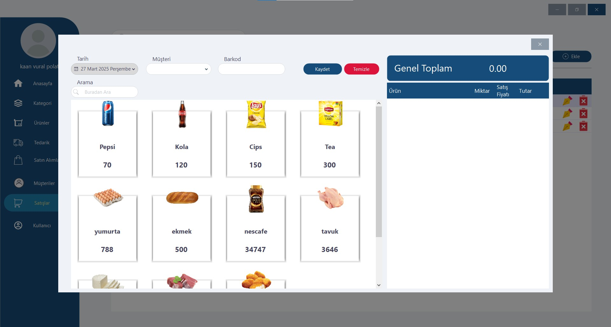

# Inventory POS System

Inventory POS System, bir envanter ve satış noktası (POS) yönetim sistemi uygulamasıdır. Bu uygulama, kullanıcıların ürünleri, müşterileri, tedarikçileri ve satış işlemlerini kolayca yönetmelerine olanak tanır.


## Özellikler

- **Ürün Yönetimi**: Ürün ekleme, düzenleme ve silme.
- **Müşteri Yönetimi**: Müşteri bilgilerini yönetme.
- **Tedarikçi Yönetimi**: Tedarikçi bilgilerini yönetme.
- **Satış ve Satın Alma**: Satış ve satın alma işlemlerini kaydetme.
- **Raporlama**: Envanter ve satış raporları oluşturma.
- **Kullanıcı Yönetimi**: Kullanıcı hesaplarını yönetme.

## Proje Yapısı

```
InventoryPosSystem/
├── frmPrintcs.cs
├── LoginForm.cs
├── MainForm.cs
├── Model/
│   ├── ucProduct.Designer.cs
│   └── ...
├── View/
│   ├── frmProductView.cs
│   └── ...
├── Properties/
│   ├── Resources.Designer.cs
│   └── ...
├── InventoryPosSystem.sln
├── InventoryPosSystem.csproj
└── Program.cs
```

## Gereksinimler

- **.NET 8.0 SDK**: Projenin çalıştırılması için gereklidir.
- **Windows İşletim Sistemi**: Uygulama yalnızca Windows platformunda çalışır.

## Kurulum

1. Bu projeyi klonlayın:
   ```bash
   git clone <repository-url>
   cd InventoryPosSystem
   ```

2. Gerekli bağımlılıkları yükleyin:
   ```bash
   dotnet restore
   ```

3. Uygulamayı çalıştırın:
   ```bash
   dotnet run
   ```

4. Uygulama başlatıldığında, ana form üzerinden işlemlerinizi gerçekleştirebilirsiniz.

## Kullanılan Teknolojiler

- **C#**: Uygulama dili.
- **Windows Forms**: Kullanıcı arayüzü geliştirme.
- **Guna.UI2**: Modern arayüz bileşenleri.
- **Microsoft.Data.SqlClient**: Veritabanı bağlantısı.

## Katkıda Bulunma

Katkıda bulunmak için lütfen bir `fork` oluşturun, değişikliklerinizi yapın ve bir `pull request` gönderin.
